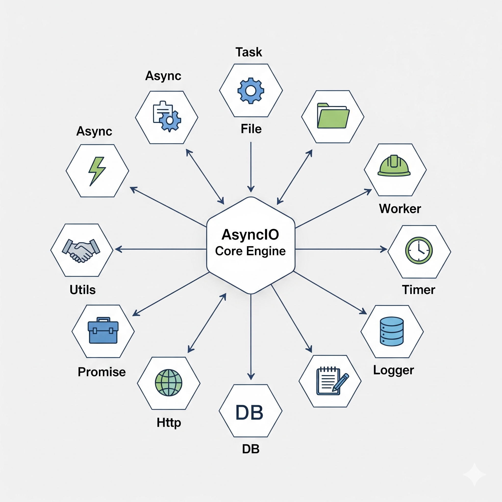

<div align="center">
  
</div>

# AsyncIO – PHP Asynchronous I/O Library

AsyncIO provides a modern way to run **non-blocking tasks** in PHP, including file I/O, HTTP requests, database queries, worker pools, timers, promises, and more.

---

## 📦 Key Features

| Module      | Function / Description                                                                 |
| :---------- | :------------------------------------------------------------------------------------ |
| **Async**   | Core engine for running async tasks. Menangani scheduling, hooks, dan error handling. |
| **Task**    | Wrapper for creating async tasks with name, priority, and cancellation.              |
| **File**    | Async file I/O: read, write, append, stream, dan file watcher.                        |
| **Worker**  | Worker pool untuk CPU-bound parallel tasks, termasuk scheduler.                       |
| **Timer**   | Async `setTimeout` & `setInterval` dengan callback.                                    |
| **Utils**   | Helper functions seperti `asyncMap`, `asyncFilter`, dsb.                               |
| **Promise** | Promise-style chaining: `all`, `race`, `any`, `resolveNow`.                            |
| **Http**    | Async HTTP requests (`requestAsync`) + support hooks before/after.                     |
| **DB**      | Async database queries (MySQL, PostgreSQL, SQLite, dsb.)                               |
| **Logger**  | Centralized logging system, mendukung level info, error, debug.                        |

---

## 🚀 Requirements

- PHP 8.1+
- Composer

---

## 📥 Installation

```bash
composer require fhylabs/asyncio
````

---

## ⚡ Usage & Best Practices

### 1. Async – Core Engine

```php
use AsyncIO\Async;
use AsyncIO\Logger;

Async::add(fn()=> Logger::log("[Async] Task executed"));

// Run all async tasks
Async::run();
```

* Use `Async::add()` to add tasks.
* Use generators for coroutine-style tasks if necessary.

---

### 2. Task – Named & Prioritized

```php
use AsyncIO\Task;
use AsyncIO\Async;
use AsyncIO\Timer;
use AsyncIO\Logger;

$task = new Task(function(){
    Logger::log("[Task] Start...");
    Timer::setTimeout(5000, fn()=> Logger::log("[Task] Finish after 5s"));
}, "singleTask", 1);

Async::add($task->callable);
```

* Priority determines the order of execution.
* Tasks can be canceled with `$task->cancel()`.

---

### 3. Worker – CPU-bound Tasks

```php
use AsyncIO\Worker;
use AsyncIO\Logger;

Worker::setConcurrency(3);
Worker::add(fn()=> Logger::log("[Worker] CPU task completed"));
Worker::schedule(fn()=> Logger::log("[Scheduler] Periodic tasks"), 5000);

// Run all workers
Worker::runQueue();
```

* Use for heavy-duty tasks to keep async loops non-blocking.

---

### 4. Timer – Delay & Interval

```php
use AsyncIO\Timer;
use AsyncIO\Logger;

Timer::setTimeout(2000, fn()=> Logger::log("[Timer] 2 seconds to finish"));
Timer::setInterval(5000, fn()=> Logger::log("[Interval] Every 5 second"));
```

---

### 5. File – Async File I/O

```php
use AsyncIO\File;
use AsyncIO\Logger;

File::readAsync("file.txt", fn($c)=> Logger::log($c));
File::appendAsync("file.txt", "\nTambah baris", fn($ok)=> Logger::log($ok ? "Append OK" : "Failed"));
File::readStreamAsync("file.txt", fn($chunk)=> Logger::log("[Stream] Chunk size: ".strlen($chunk)));
File::watchFile("file.txt", fn($p)=> Logger::log("File changed: $p"));
```

---

### 6. Http – Async Request + Hooks

```php
use AsyncIO\Http;
use AsyncIO\Async;
use AsyncIO\Logger;

Async::addHook('before', fn($t)=> Logger::log("[Hook Before] HTTP task"));
Async::addHook('after', fn($t)=> Logger::log("[Hook After] HTTP task"));

Async::add(fn()=> Http::requestAsync(
    ['https://jsonplaceholder.typicode.com/todos/1'],
    ['method'=>'GET','timeout'=>5],
    fn($res)=> Logger::log("[HTTP] Got ".count($res)." responses")
));
```

---

### 7. DB – Async Queries

```php
use AsyncIO\DB;
use AsyncIO\Logger;

class MyDB extends DB {
    public function __construct(){ parent::__construct("mysql:host=127.0.0.1;dbname=demo","root",""); }
}

$db = new MyDB();
$db->queryAsync("SELECT id,name FROM users LIMIT 3", fn($res)=>{
    foreach($res as $row) Logger::log("[DB] {$row['id']} - {$row['name']}");
});
```

---

### 8. Utils – Async Map

```php
use AsyncIO\Utils;
use AsyncIO\Logger;

Utils::asyncMap([1,2,3], fn($n,$done)=> $done($n*2), fn($res)=> Logger::log("[Utils] Doubled: ".implode(",",$res)));
```

---

### 9. Promise – Chaining, All, Race

```php
use AsyncIO\Promise;
use AsyncIO\Timer;
use AsyncIO\Logger;

$p1 = new Promise(fn($resolve,$reject)=> Timer::setTimeout(1000, fn()=> $resolve("1")));
$p2 = new Promise(fn($resolve,$reject)=> Timer::setTimeout(2000, fn()=> $resolve("2")));

Promise::all([$p1,$p2], fn($res)=> Logger::log("[All] ".implode(",",$res)));
Promise::race([$p1,$p2], fn($winner)=> Logger::log("[Race] $winner"));
```

---

### 10. Logger – Consistent Logging

```php
use AsyncIO\Logger;

Logger::log("[INFO] Standard log messages");
```

---

### 🔹 Best Practices

* Add all tasks before `Async::run()`.
* Use `Worker` for CPU-bound tasks to keep async loops non-blocking.
* Use `Timer` for delays/intervals.
* Use `Task` with priority to execute important tasks first.
* The `before` & `after` hooks can be applied to Http tasks or other tasks.
* Logger is used for output consistency and debugging.

---

## ⚡ Project Structure

```
AsyncIO/
│
├─ src/
│   ├─ Async.php
│   ├─ Task.php
│   ├─ File.php
│   ├─ Worker.php
│   ├─ Timer.php
│   ├─ Utils.php
│   ├─ Promise.php
│   ├─ Http.php
│   ├─ DB.php
│   └─ Logger.php
│
├─ examples/
│   ├─ example.php
│   └─ data/
│       └─ sample.txt
│
├─ composer.json
└─ vendor/  (composer dependencies)
```

<div align="center">
  
</div>
